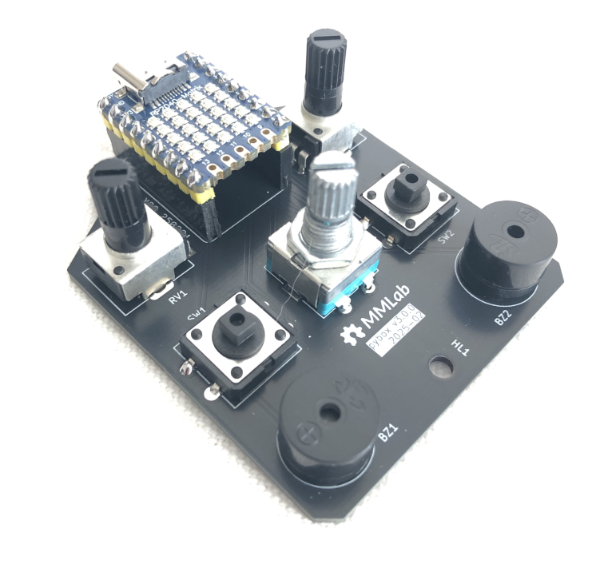

Intro
=====

`pybox` is a didactical box, equipped with a *rp2040* chip (the same present in the `Raspberry Pi Pico <https://www.raspberrypi.com/products/raspberry-pi-pico/>`_) to manage the following devices: 

- *RGB* led 
- 25 RGB led matrix 
- 2 potentiometers 
- 1 rotary encoder
- 3 buttons 
- 2 mini-speakers 

the project aims to help teachers to teach the programming of *microcontrollers* and students to learn by having fun and doing immediately practice without worrying about building any hardware. 
The language used is python (to be clear `CircuitPython <https://circuitpython.org/>`_) and all you have to do is import a package called `pybox` and his various modules. 
If you want to explore source code and hardware design you can visit this `repo <https://github.com/franeum/pybox3>`_.

.. code-block:: bash

  ls -la