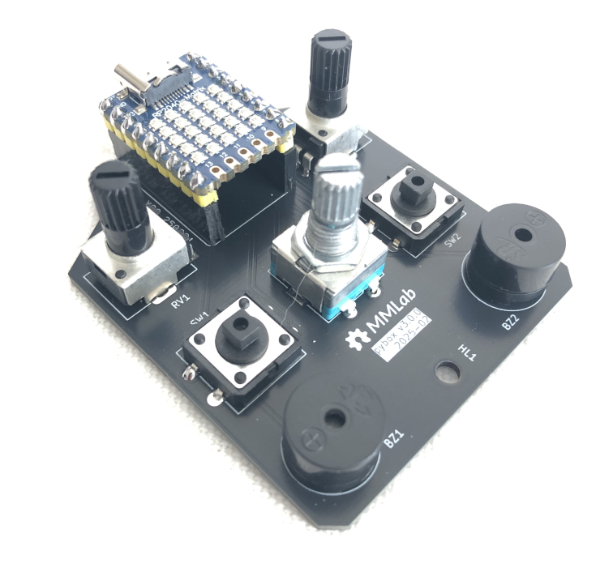

# Welcome to pybox

by [Francesco Bianchi](https://www.francescobianchi.cloud)

`pybox` is a didactical box, equipped with a *rp2040* chip (the same present in the [Raspberry Pi Pico](https://www.raspberrypi.com/products/raspberry-pi-pico/)) to manage the following devices: 

- *RGB* led 
- 25 RGB led matrix 
- 2 potentiometers 
- 1 rotary encoder
- 3 buttons 
- 2 mini-speakers 

the project aims to help teachers to teach the programming of *microcontrollers* and students to learn by having fun and doing immediately practice without worrying about building any hardware. 
The language used is python (to be clear [CircuitPython](https://circuitpython.org/)) and all you have to do is import a package called `pybox` and his various modules. 
If you want to explore source code and hardware design you can visit this [repo](https://github.com/franeum/pybox3).

In these pages you can find the documentation of the software to manage attached devices and a series of exercises to make practice. 

Modules exported by this package: 

- [`BUTTON`](button.md): button(s) manager  
- `COLOR`: contains tuples representing various colors 
- `ENCODER`: encoder manager
- [`LED`](led.md): internal or external led
- [`MATRIX`](matrix.md): 25 rgb led matrix  
- `POT`: integrated pontiometer 
- `SIMPLEMIDI`: simple midi sender
- `TONE`: tone generator to produce sound from integrated speaker  
